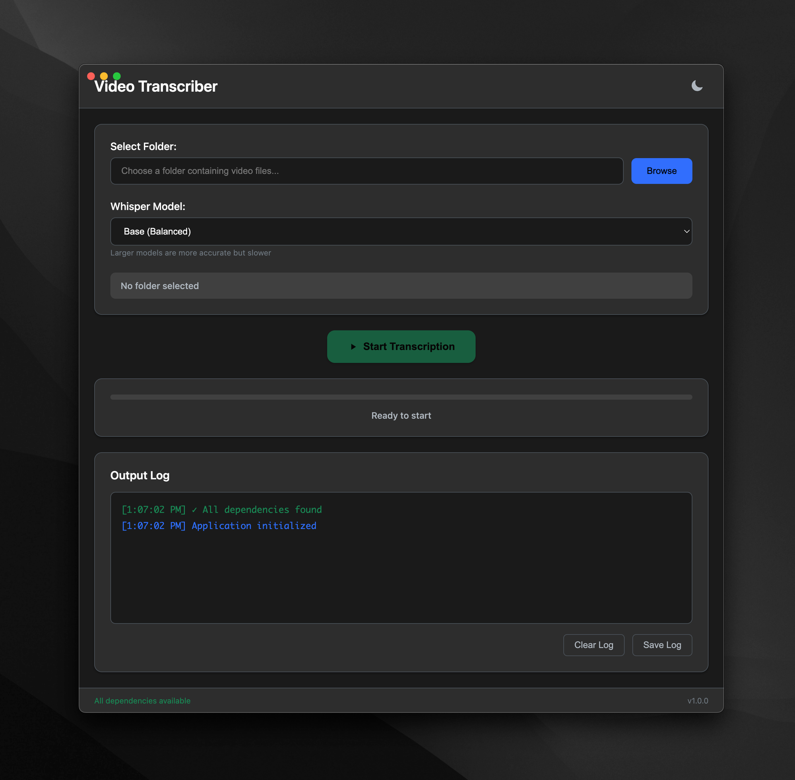

# Video Transcriber 🎥

> Batch transcribe video files with AI-powered Whisper accuracy


[](https://opensource.org/licenses/MIT)
[](https://www.electronjs.org/)
[](https://nodejs.org/)
[](https://github.com/sanchez314c/VideoTranscriber/releases)

## 📸 Main Interface



> The Ultimate Video Transcription Tool - Transform Video to Text with AI Precision

Video Transcriber is a powerful desktop application that makes transcribing video files effortless. Built with Electron and OpenAI's Whisper model, it provides a beautiful dark interface for batch processing multiple video files simultaneously with real-time progress tracking and high-accuracy transcription output.

## ✨ Features

- 🎬 **Batch Processing** - Process multiple video files simultaneously
- 🤖 **Multiple AI Models** - Choose from Whisper's tiny, base, small, medium, or large models
- 📁 **Wide Format Support** - MP4, AVI, MOV, MKV, FLV, WMV, WebM, M4V, MPG, MPEG, and more
- ⚡ **Real-time Progress** - Live progress tracking with detailed logging
- 🎨 **Beautiful Dark UI** - Modern, responsive interface that's easy on the eyes
- 🌙 **Dark Mode Support** - Eye-friendly dark theme by default
- 💾 **Export Logs** - Save transcription logs for reference and review
- 🔧 **Smart Dependencies** - Automatic dependency checking and installation guidance
- 🖥️ **Cross-Platform** - Works on macOS, Windows, and Linux
- 🚀 **GPU Acceleration** - Automatic detection and support for GPU acceleration

## 📸 Screenshots

<details>
<summary>View Screenshots</summary>


*Main interface showing file selection and transcription controls*

</details>

## 🚀 Quick Start - One-Command Build & Run

### Option 1: One-Command Solution (Recommended)

```bash
# Clone and build
git clone https://github.com/sanchez314c/VideoTranscriber.git
cd VideoTranscriber

# Build and run with a single command!
./build-release-run.sh
```

### Option 2: Development Mode

```bash
# Run in development mode with hot reload
./build-release-run.sh --dev
```

### Build Options

```bash
# Build only (don't launch)
./build-release-run.sh --build-only

# Clean build
./build-release-run.sh --clean

# Build for specific platform
./build-release-run.sh --platform mac
./build-release-run.sh --platform win
./build-release-run.sh --platform linux

# Build for all platforms
./build-release-run.sh --platform all
```

## 📋 Prerequisites

For running from source:
- **Node.js** 16+ and npm
- **Python** 3.7+ (for Whisper model)
- **FFmpeg** (for video processing)
- **Git** (for cloning)

The application will guide you through installing any missing dependencies.

## 🛠️ Installation

### Detailed Installation

```bash
# Clone the repository
git clone https://github.com/sanchez314c/VideoTranscriber.git
cd VideoTranscriber

# Install Node.js dependencies
npm install

# Install Python dependencies
pip install -r requirements.txt

# Install FFmpeg
# macOS: brew install ffmpeg
# Windows: Download from https://ffmpeg.org/
# Linux: sudo apt install ffmpeg

# Start the application
./build-release-run.sh
```

### Building from Source

```bash
# One-command build for current platform
./build-release-run.sh --build-only

# Build for all platforms
./build-release-run.sh --platform all --build-only

# Build for specific platforms
./build-release-run.sh --platform win --build-only
./build-release-run.sh --platform mac --build-only
./build-release-run.sh --platform linux --build-only
```

### Build Output Locations

After building, find your executables in:
- **macOS**: `dist/Video Transcriber-*.dmg` and `dist/mac*/Video Transcriber.app`
- **Windows**: `dist/Video Transcriber Setup *.exe`
- **Linux**: `dist/Video Transcriber-*.AppImage` and `dist/*.deb`

## 📖 Usage

### 1. Starting the Application

- **Pre-built Binary**: Just double-click the application
- **From Source**: Run `npm start` or `./build-release-run.sh`

### 2. Selecting Video Files

1. Click "Browse" to choose a folder containing video files
2. The app will automatically detect supported video formats
3. Select specific files or process all files in the folder

### 3. Choosing Whisper Model

Select the appropriate Whisper model based on your needs:
- **Tiny** (39MB): Fastest, good for quick drafts
- **Base** (74MB): Fast, better quality, great for general use
- **Small** (244MB): Medium speed, good accuracy
- **Medium** (769MB): Slower, better accuracy
- **Large** (1550MB): Slowest, best accuracy for professional transcription

### 4. Transcription Process

1. Configure settings (model choice, output format)
2. Click "Start Transcription" to begin processing
3. Monitor real-time progress and detailed logs
4. Access completed transcriptions saved alongside video files

## 🔧 Configuration

### Directory Structure

```
Video Transcriber/
├── src/                  # Source code
├── build_resources/      # Icons and screenshots
├── scripts/             # Build and utility scripts
├── dist/                # Build outputs (generated)
├── requirements.txt     # Python dependencies
└── models/             # Whisper models (downloaded automatically)
```

### Whisper Models Reference

| Model  | Size   | Speed    | Accuracy | VRAM Required | Use Case |
|--------|--------|----------|----------|---------------|----------|
| tiny   | 39MB   | Fastest  | Good     | ~1GB          | Quick drafts, testing |
| base   | 74MB   | Fast     | Better   | ~1GB          | General use (default) |
| small  | 244MB  | Medium   | Good     | ~2GB          | Balanced performance |
| medium | 769MB  | Slower   | Better   | ~5GB          | High accuracy needs |
| large  | 1550MB | Slowest  | Best     | ~10GB         | Professional transcription |

## 🐛 Troubleshooting

### Common Issues

<details>
<summary>FFmpeg not found</summary>

Install FFmpeg for your platform:
```bash
# macOS
brew install ffmpeg

# Windows
# Download from https://ffmpeg.org/download.html

# Linux
sudo apt install ffmpeg  # Ubuntu/Debian
sudo dnf install ffmpeg  # Fedora
```
</details>

<details>
<summary>Python dependencies missing</summary>

Install required packages:
```bash
pip install -r requirements.txt
```
</details>

<details>
<summary>Transcription fails or is slow</summary>

1. Check the video file format is supported
2. Ensure sufficient disk space and RAM
3. Try a smaller Whisper model for better performance
4. Check logs in the application for detailed error messages
</details>

<details>
<summary>GPU not detected</summary>

- **macOS**: Metal acceleration should work automatically
- **Windows/Linux**: Ensure CUDA is installed and PyTorch was built with CUDA support
- The app will fall back to CPU processing if GPU is unavailable
</details>

## 📁 Project Structure

```
Video Transcriber/
├── package.json              # Node.js configuration and dependencies
├── package-lock.json         # Dependency lock file
├── tsconfig.json             # TypeScript configuration
├── .eslintrc.json            # ESLint configuration
├── src/                      # Source code
│   ├── main.js              # Electron main process
│   ├── preload.js           # Preload script
│   ├── renderer.js          # Renderer process
│   ├── index.html           # Application UI
│   ├── styles.css           # Application styles
│   └── assets/              # Application assets
│       └── icons/           # Application icons
├── build_resources/          # Build resources and assets
│   ├── icons/               # Platform-specific icons
│   └── screenshots/         # Application screenshots
├── scripts/                  # Utility scripts
│   └── build-compile-dist.sh # Universal build script
├── dev/                      # Development files
│   ├── install.js           # Setup helper
│   └── launch.command       # macOS launch script
├── requirements.txt          # Python dependencies
├── archive/                  # Archived/backup files
└── dist/                     # Build outputs (generated)
```

## 🤝 Contributing

Contributions are welcome! Please feel free to submit pull requests or create issues for bug reports and feature requests.

### Development Setup

```bash
# Clone the repo
git clone https://github.com/sanchez314c/VideoTranscriber.git
cd VideoTranscriber

# Install dependencies
npm install
pip install -r requirements.txt

# Run in development mode
./build-release-run.sh --dev

# Run tests
npm test

# Lint code
npm run lint
```

## 📄 License

This project is licensed under the MIT License - see the [LICENSE](LICENSE) file for details.

## 🙏 Acknowledgments

- [OpenAI Whisper](https://github.com/openai/whisper) - The amazing speech recognition model that powers transcription
- [Electron](https://www.electronjs.org/) - For making cross-platform development possible
- [FFmpeg](https://ffmpeg.org/) - For powerful video and audio processing
- The open-source AI community for making these incredible tools available

## 🔗 Links

- [Report Issues](https://github.com/sanchez314c/VideoTranscriber/issues)
- [Request Features](https://github.com/sanchez314c/VideoTranscriber/issues/new?labels=enhancement)
- [Discussions](https://github.com/sanchez314c/VideoTranscriber/discussions)

---

**Video Transcriber v1.0** - AI-Powered Video Transcription
Built with AI! 🚀